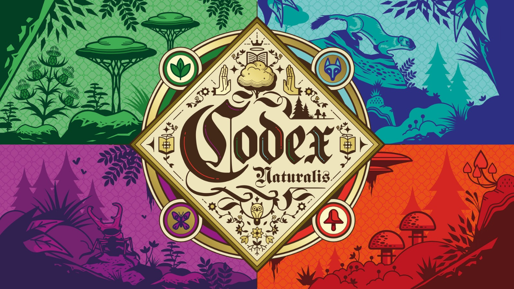

# Progetto Ingegneria del Software 2023/2024

Codex naturalis is a game developed by Cranio Creations, as a physical board game.

This project is a digital adaptation of the game, developed by the **GC47** team, as part of the Software Engineering course at Politecnico di Milano.

The team members are:

- [Beniamino Perri]()
- [Nicolò Ravasio](https://github.com/nicoloravasio)
- [Paolo Vanotti](https://github.com/Van-Paolo)
- [Davide Roccuzzo](https://github.com/Roccuzz0)

## What was implemented

| Feature                  | Implemented? |
|--------------------------|------------|
| CLI                      | ✔️         |
| Base rules               | ✔️         |
| Complete rules           | ✔️         |
| CLI                      | ✔️         |
| GUI                      | ✔️         |
| RMI                      | ✔️         |
| Socket                   | ✔️         |
| Chat (1FA)               | ✔️         |
| Server Persistence (2FA) | ✔️         |
| Multiple games (3FA)     | ❌         |
| Disconnection  (4FA)     | ❌         |

## Test coverage

| Package    | Class coverage | Method coverage | Line coverage |
|------------|----------------|-----------------|-------------|
| Model       | 78% (15/19)    | 92% (208/226)   | 83%(661/788) |
| Controller | 100% (1/1)     | 52% (20/38)     | 48%(54/112) |

